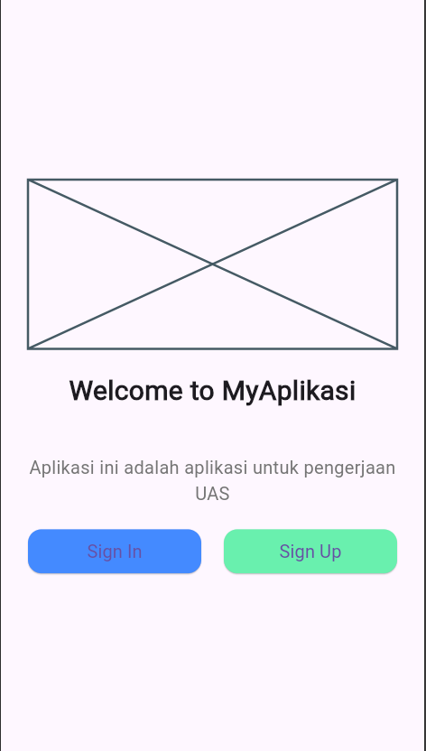
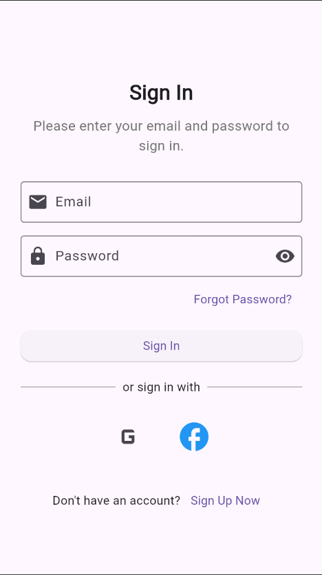
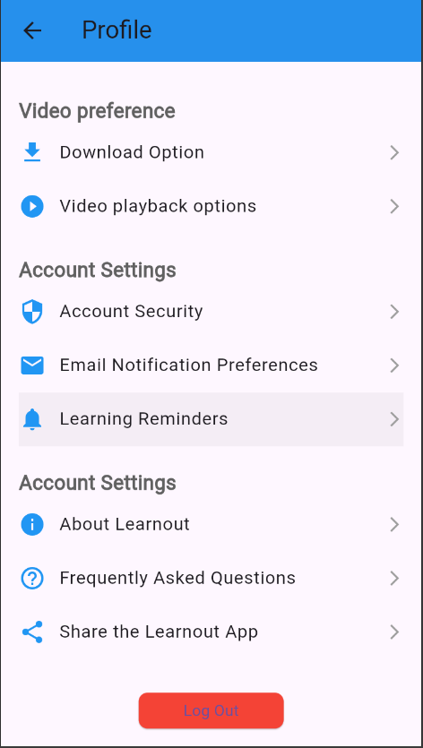

# template_project

A new Flutter project.

# Nama : Moh. Naufal
# NIM : 362358302146
# Kelas : 2A

# Tampilan untuk screen login yang berisi pilihan antara sign In dan Sign Up

# Tampilan Sign In dan Sign Up

# Tampilan Home 

# Tampilan Profile dan ada Popupnya untuk konfirmasi Log Outnya

# Tampilan Messages

## Getting Started

This project is a starting point for a Flutter application.

A few resources to get you started if this is your first Flutter project:

- [Lab: Write your first Flutter app](https://docs.flutter.dev/get-started/codelab)
- [Cookbook: Useful Flutter samples](https://docs.flutter.dev/cookbook)

For help getting started with Flutter development, view the
[online documentation](https://docs.flutter.dev/), which offers tutorials,
samples, guidance on mobile development, and a full API reference.
